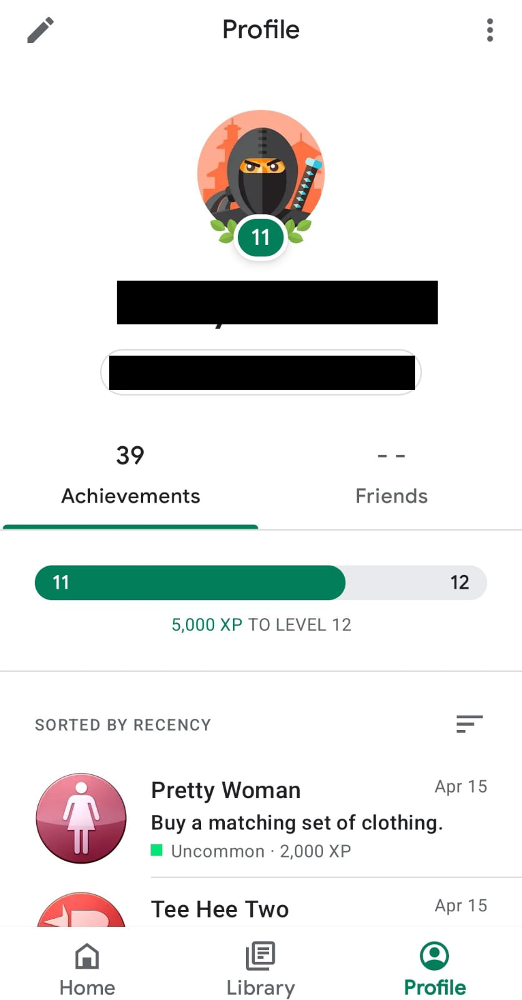

  

<h1 align="center">Kleos - Unlock Achievement and XP (Google Play)</h1>

Software criado para fins de estudos que permite desbloquear conquistas e aumentar o nível (XP) no Google Play Games.

 
<h1 align="left">Como funciona ?</h1>  

Basicamente eu pego as conquistas dos jogos em um banco SQLite temporário onde ficam guardados quando logam a Google Play no jogo, existem tabelas que cuidam de tudo para elas, inclusive STATUS que mostram se estão liberadas ou não, basicamente pega as que estão bloqueadas e reescrevo em um banco SQLite que sincroniza com a Google Play, esse processo deve ser feito com o WiFi desligado, daí é usado o programa Kleos e ao finalizar selecionando as conquistas que selecionou de cada jogo deve dar push no banco e ligar novamente o Wifi no emulador Android.

<h1 align="left">Observação:</h1>  

Eu fiz isso usando um emulador com root, então usei versões desatualizadas da Google Play Games. Você pode fazer no celular próprio, mas existem alguns detalhes que você precisa tomar atenção, como ter root no celular, mas não fiz e testei diretamente em um celular. 

<h1 align="left">Imagem da conta teste que utilizei JetPack JoyRide como exemplo:</h1>  

  
  

<h1 align="left">O que você vai precisar para montar o proejto e rodar ?</h1>  

Precisarar do RootAVD, mesmo ele estando extremamente desatualizado foi o que eu usei, até onde testei ele funciona com API 31-.

<a href="https://github.com/newbit1/rootAVD" target="_blank">Repositório dele aqui</a>

Precisará instalar o Magisk também. 

<a href="https://magiskmanager.com/" target="_blank">Site oficial deles</a>

Usei o Android Studio para emular as configurações: 

Pixel 4, Android 12.0 x86_64 com Google Play

E usei essa versão do APK Google Play Games:

<a href="https://www.apkmirror.com/apk/google-inc/google-play-games/google-play-games-2021-10-30471-release/google-play-games-2021-10-30471-406188382-406188382-000800-2-android-apk-download/?redirected=thank_you_invalid_nonce" target="_blank">Link do APK</a>

Os jogos baixei pela Google Play mesmo. Usei essa versão APK da Google Play porque atualmente eles mudaram a forma de comunicação de liberar as conquistas. 

Resumo da ópera: 

Para usar você vai rodar o projeto C# junto ao emulador no Android Stuido com root, baixe o jogo, entre nele, logue com a Google PLay Games, navegue pelas conquistas do jogo na Google Play Games, desligue o WiFi no emulador, use o programa que criei em C# (deixei o mais intuitivo possível, futuramente adiciono uma detalhamento sobre ele), depois lgue o WiFi e veja as conquistas.

